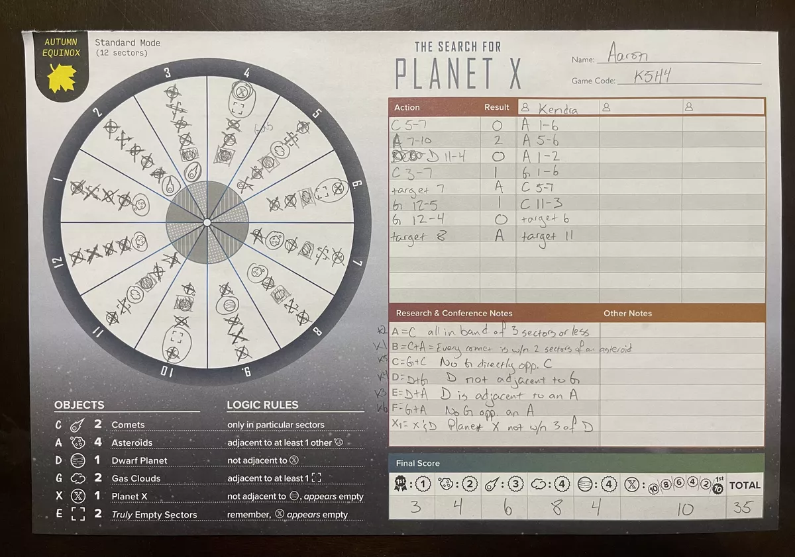

# Search for planet X notetaking app

This is a toy project for me to teach myself some more react and state management with a defined goal.

# Background (The Search for Planet X)
The Search for Planet X is an app drive logic deduction board game (https://boardgamegeek.com/boardgame/279537/the-search-for-planet-x)
The game consists of 12 (18 in expert variant) sectors of the sky. Each sector of the sky contains exactly 1 of 6 types of celestial objects
Comets, Asteroids, Dwarf Planets, Gas Clouds, Empty Space or Planet X. There are rules defining exactly how many of each type of object there are
as well as placement rules, eg Gas Clouds must be next to at least one empty space, dwarf planets cannot be next to planet x, etc

The app randomises what's in each sector as well as what starting information players might get and what information is provided from research actions

Because it's a multiplayer game, it's a race to find planet X first, players take actions to survey the sky, perform research, target a sector and so on
Actions come with a time cost, and at certain points in the game, players can publish theories, represented by tokens about what's in a certain sector.
The first to publish correctly gets extra points. Finding planet X requires knowing which sector it is in, as well as what is adjacent to it.

The multiplayer nature means you can also make deductions or inferences about what's in certain sectors based upon the actions other players have taken and what they have published.
In

# Paper sheet
The deduction sheet provided with the game contains this. Key components are an action and result log for player, as well as action log for other players
Reminder of the logic rules of celestial objects
Space for Research and conference notes
As well as what could be in each sector for confirming or eliminating as the game goes on.

Sometimes during the game, a player may make an incorrect deduction and be unable to rewind their notes and scribbles and need a second sheet

# Goals
To build a digital version of the sheet that facilitates game play in a seamless way.
To allow players to undo or redo deductions easily.

# React + Vite

This template provides a minimal setup to get React working in Vite with HMR and some ESLint rules.

Currently, two official plugins are available:

- [@vitejs/plugin-react](https://github.com/vitejs/vite-plugin-react/blob/main/packages/plugin-react/README.md) uses [Babel](https://babeljs.io/) for Fast Refresh
- [@vitejs/plugin-react-swc](https://github.com/vitejs/vite-plugin-react-swc) uses [SWC](https://swc.rs/) for Fast Refresh
